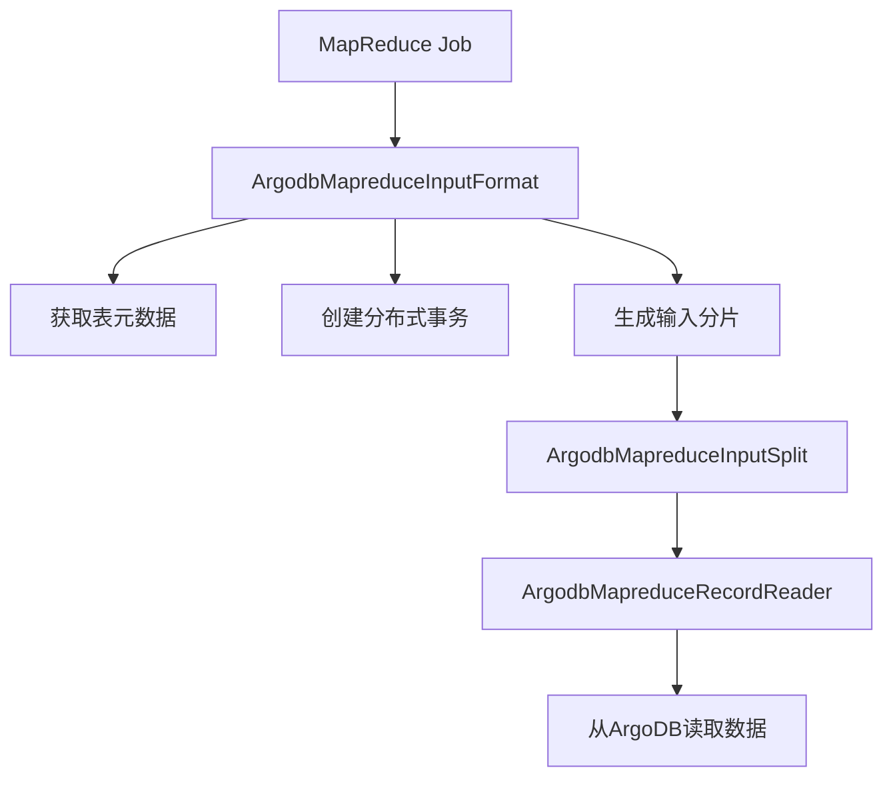

# ArgoDB-MapReduce 集成组件

 


## 项目简介

argodb-mapreduce 是星环科技(Transwarp)开发的 Hadoop MapReduce 输入格式实现，专为与 ArgoDB 数据库集成设计。该项目提供了高效的数据读取能力，使 MapReduce 作业能够直接处理 ArgoDB 中的大规模数据集。

## 核心特性

### 🚀 高性能数据接入
- 实现自定义的 `InputFormat` 完整组件链
- 支持批量数据扫描和分区剪枝优化
- 自动处理数据分布和分片(split)逻辑

### 🔒 可靠的事务支持
- 内置分布式事务管理
- 自动处理事务的创建、提交和终止
- 支持只读共享锁机制

### 🧩 无缝生态集成
- 与 Hive 类型系统(HCatalog)深度集成
- 兼容标准 Hadoop MapReduce API
- 支持 Hive 默认分区值处理

## 快速开始

### 前置要求
- Java 8+
- Hadoop 2.x+
- ArgoDB 客户端库

### 基本使用

```java
// 在MapReduce作业中设置输入
Job job = Job.getInstance(conf);
ArgodbMapreduceInputFormat.setInput(job, "database_name", "table_name");

// 可选: 设置过滤条件(仅支持单值分区表)
ArgodbMapreduceInputFormat.setInput(job, "database_name", "table_name", "partition_column=value");

// 设置Mapper等常规配置
job.setInputFormatClass(ArgodbMapreduceInputFormat.class);
...
```

## 架构设计



## 配置参数

所有配置参数通过 `Configs` 类管理，主要包含:

| 参数 | 说明 | 示例值 |
|------|------|--------|
| `argodb.jdbc.url` | ArgoDB JDBC连接URL | `jdbc:argo://host:port/db` |
| `argodb.jdbc.user` | 数据库用户名 | `admin` |
| `argodb.jdbc.password` | 数据库密码 | `password` |
| `argodb.table.name` | 要读取的表名 | `database.table` |
| `argodb.filter` | 分区过滤条件 | `date=20230101` |

## 构建与测试

```bash
# 使用Maven构建
mvn clean package -DskipTests

# 运行单元测试
mvn test
```

## 贡献指南

我们欢迎各种形式的贡献！请阅读以下指南：
1. 提交Issue报告问题或建议新功能
2. Fork仓库并提交Pull Request
3. 遵循现有代码风格
4. 确保所有测试通过

## 许可证

本项目采用 [Apache License 2.0](LICENSE) 开源许可证。

## 相关资源

- [ArgoDB 官方文档](https://www.transwarp.io/documentation)
- [Hadoop MapReduce 教程](https://hadoop.apache.org/docs/current/hadoop-mapreduce-client/hadoop-mapreduce-client-core/MapReduceTutorial.html)

## 社区支持

如有任何问题，可通过以下方式联系我们：
- GitHub Issues
- 星环科技技术支持邮箱: support@transwarp.io

---

<p align="center">
  <b>由星环科技(Transwarp)开源技术团队维护</b>
</p>
